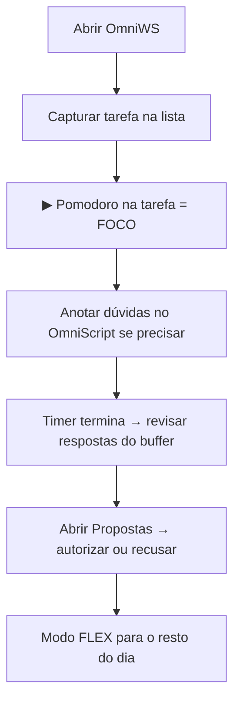

# Guia de uso — Omni Work Station

Este guia explica **como usar a estação no dia a dia**, sem precisar ser programador.  
Para um primeiro contato rápido (10 minutos), veja também [`PRIMEIROS_10_MINUTOS.md`](PRIMEIROS_10_MINUTOS.md).

---

## O que é a Omni Work Station?

É um **aplicativo de desktop** (Windows) que junta em um só lugar:

- **Tarefas** (lista GTD — “próximas ações”)
- **Pomodoro** (timer de foco de 25 minutos)
- **IA local** (opcional, via Ollama)
- **Caixa de Propostas** (nada instala ou muda sozinho — você autoriza)
- **Atalhos** para apps e sites que você usa

A ideia central: **a estação sugere; você decide.**

---

## Primeiro acesso (v1.5)

1. Abra o app — aparece a **tela de login**
2. Na primeira vez: crie **nome do perfil** + **PIN** (mín. 4 caracteres)
3. Nas próximas vezes: digite o PIN e entre
4. Você verá o **Launcher central** — atalhos para apps/sites
5. Clique **Entrar na estação** para GTD, Pomodoro, notas e propostas
6. Use **⛶ Tela cheia** no topo (padrão após login) ou **🚀 Launcher** para voltar

---

## Como abrir o app

### Opção A — Desenvolvimento (pasta do projeto)

1. Abra o PowerShell na pasta do projeto (ex.: `C:\_PROJETOS\COmniWS`)
2. Rode:

```powershell
npm run dev
```

A janela do Omni Work Station abre sozinha.

### Opção B — Instalador (quando existir)

1. Gere o instalador com `npm run dist:win` (ou use uma release já publicada)
2. Execute o `.exe` em `release/`
3. Abra **Omni Work Station** pelo menu Iniciar

### Ícone na bandeja do sistema

Depois de aberto, o app pode ficar na **bandeja** (perto do relógio).  
Clique no ícone para **mostrar ou esconder** a janela.  
Botão direito no ícone: **Modo FOCO**, **Modo FLEX** ou **Sair**.

---

## Visão geral da tela

```
┌─────────────────────────────────────────────────────────────┐
│  Omni Work Station    [modo]     Propostas | IA | 2ª tela …  │  ← barra superior
├─────────────────────────────────────────────────────────────┤
│  ⏱️ Pomodoro    │  📋 Próximas Ações  │  🚀 Launcher        │
├─────────────────────────────────────────────────────────────┤
│  💬 OmniScript (chat IA)     │  🔧 Ambiente (winget)        │
└─────────────────────────────────────────────────────────────┘
```

| Área | Para que serve |
|------|----------------|
| **Pomodoro** | Timer 25 min, pausar, resetar |
| **Próximas Ações** | Criar, concluir e remover tarefas |
| **Launcher** | Abrir Cursor, VS Code, GitHub, etc. |
| **OmniScript** | Perguntas e anotações para a IA |
| **Ambiente** | Ver o que está instalado no PC (winget) |
| **Barra superior** | Modos, propostas, segunda tela, tema, requisitos |

---

## Os três modos

O modo aparece no topo (badge colorido). Você pode trocar pelos botões **FLEX** / **APRENDIZADO** ou pelos atalhos abaixo.

| Modo | Quando usar | Comportamento da IA |
|------|-------------|---------------------|
| **FLEX** | Dia a dia (padrão) | Responde na hora no OmniScript |
| **FOCO** | Durante o Pomodoro | Perguntas vão para um **buffer**; respostas só **depois** do timer |
| **APRENDIZADO** | Quando quiser explicações mais didáticas | Tom de “ensinar” nas respostas |

### Entrar em FOCO

- Clique **▶** numa tarefa (inicia Pomodoro **e** modo FOCO), **ou**
- Inicie o Pomodoro e use atalho `Ctrl+Shift+1`, **ou**
- Bandeja do sistema → **Modo FOCO**

Enquanto estiver em FOCO:

- O inventário (winget) **não atualiza** — para não te interromper
- Notificações proativas da IA ficam **reduzidas**
- No OmniScript, o texto vira **anotação** guardada para depois

Ao **terminar** o Pomodoro, as anotações do buffer podem ser processadas automaticamente.

---

## Tarefas (GTD)

1. Na coluna **📋 Próximas Ações**, digite o título da tarefa
2. Pressione **Enter** ou clique **+**
3. Na lista:
   - **▶** — inicia Pomodoro ligado a essa tarefa (entra em FOCO)
   - **✅** — marca como concluída
   - **🗑️** — remove a tarefa

As tarefas ficam salvas **no seu computador** (banco SQLite local). Não precisa de internet para a lista.

---

## Pomodoro

| Botão | Ação |
|-------|------|
| **▶ Iniciar** | Começa 25:00 (sem tarefa, se não clicou ▶ na lista) |
| **⏸ Pausar** | Pausa o timer |
| **🔄 Reset** | Volta para 25:00 |

Quando o tempo acaba, aparece um aviso na tela: **Pomodoro concluído**.

**Dica:** para uma sessão de foco completa, use **▶ na tarefa** — assim o timer mostra qual tarefa você está fazendo.

---

## OmniScript (conversa com a IA)

1. Role até **💬 OmniScript**
2. Digite sua pergunta ou anotação
3. Clique **Enviar** ou use o atalho para focar o campo (`Ctrl+Shift+F`)

### IA offline?

Se aparecer aviso de **Ollama offline**:

1. Instale em [ollama.com](https://ollama.com)
2. No terminal, rode: `ollama run llama3.2:3b`
3. Volte ao app e pergunte de novo

A IA é **opcional**. Tarefas, Pomodoro e Propostas funcionam sem ela.

### Modo FOCO no OmniScript

- Você **pode** digitar durante o foco
- As mensagens são **guardadas**, não respondidas na hora
- Ao fim do Pomodoro, o app pode processar o buffer e mostrar respostas no histórico

---

## Caixa de Propostas

Clique **📦 Propostas** no topo (ou `Ctrl+Shift+P`).

Aqui aparecem **sugestões** — por exemplo instalar uma ferramenta que o inventário detectou como ausente, ou ideias vindas da sondagem da IA.

| Ação | O que faz |
|------|-----------|
| **Autorizar** | Você aceita; se for instalação, o app mostra o comando para rodar no terminal (não instala sozinho) |
| **Recusar** | Descarta esta proposta |
| **Recusar para sempre** | Não sugere de novo aquele item |
| **Agendar** | Adia a decisão para outra data/hora |

Tudo fica registrado no **log de auditoria** (visível na mesma área).

**Regra importante (R1):** nada crítico acontece sem você clicar em autorizar.

---

## Ambiente (inventário winget)

Na seção **🔧 Ambiente**:

1. Clique **🔄 Atualizar** (não funciona durante FOCO)
2. Veja ferramentas **instaladas** e **ausentes**
3. Em um item ausente, **📦 Sugerir Instalação** cria uma proposta na Caixa

Precisa do **winget** (gerenciador de pacotes do Windows). Se falhar, use o botão **🔧** no topo → verificador de requisitos.

---

## IA autônoma e sondagem

Clique **🧠 Acompanhar IA** para ver o “stream” do que a IA está fazendo em segundo plano.

- A **sondagem** roda em ciclos (aprox. a cada 4 horas) em **fontes curadas** (RSS)
- Novidades viram **propostas** — não viram ações automáticas
- Você pode **pausar** a sondagem no painel (respeita R5: você controla o modo autônomo)
- Botão para **executar sondagem agora** (se quiser testar)

Use isso quando quiser **transparência**, não é obrigatório no dia a dia.

---

## Segunda tela (multitela)

Clique **🖥️ Segunda Tela** para abrir uma janela auxiliar (ex.: monitor ao lado).

- Mostra timer e modo sincronizados com a janela principal
- Só abre **quando você pede** (regra R6)
- Clique de novo para **Fechar 2ª tela**

---

## Launcher rápido

Atalhos fixos na interface: Cursor, VS Code, GitHub, Supabase, Vercel.  
Um clique abre o app ou o site no navegador padrão.

*(No futuro você pode personalizar caminhos no código; hoje são os padrões do projeto.)*

---

## Atalhos de teclado

| Atalho | Ação |
|--------|------|
| `Ctrl+Shift+F` | Foco no campo do OmniScript |
| `Ctrl+Shift+P` | Abrir/fechar Propostas |
| `Ctrl+Shift+1` | Modo FOCO |
| `Ctrl+Shift+2` | Modo FLEX |
| `Ctrl+Shift+3` | Modo APRENDIZADO |

---

## Tema e requisitos

- **Tema claro/escuro:** botão de tema ao lado do 🔧 no topo
- **🔧 Verificador:** confere RAM, winget e Ollama — útil na primeira vez

---

## Fluxo de trabalho sugerido (rotina simples)



1. **Manhã:** adicione o que precisa fazer hoje  
2. **Bloco de foco:** ▶ na tarefa mais importante  
3. **Depois do Pomodoro:** processe buffer + propostas  
4. **Fim do dia:** conclua tarefas (✅) ou remova o que não vale mais  

---

## Regras de segurança (em linguagem simples)

| Regra | Na prática |
|-------|------------|
| **R1** | Nada instala ou executa sozinho — você autoriza na Caixa |
| **R2** | IA busca só em fontes definidas pelo projeto |
| **R3** | Em FOCO, o app não te interrompe com inventário/IA barulhenta |
| **R4** | Ações importantes ficam no log de auditoria |
| **R5** | Você pode pausar a sondagem / IA autônoma |
| **R6** | Segunda tela só abre se você clicar |

---

## Problemas comuns

| Situação | O que fazer |
|----------|-------------|
| App não abre com `npm run dev` | Rode `npm install` na pasta; feche outras janelas do app que estejam abertas |
| Porta 5173 ocupada | Feche instâncias antigas do `npm run dev` no Gerenciador de Tarefas |
| IA não responde | Instale e inicie Ollama (`llama3.2:3b`) |
| Inventário vazio ou erro | Instale/atualize **winget** (App Installer da Microsoft Store) |
| Proposta de instalação | Autorize na Caixa e copie o comando que o app mostrar |
| Quero só tarefas e timer | Use sem Ollama — FLEX + GTD + Pomodoro bastam |

Logs do app (para suporte técnico): pasta de dados do usuário, arquivo rotativo via `electron-log` (até 10 MB).

---

## Onde os dados ficam

Tudo fica **local** no seu PC (tarefas, conversas, propostas, audit log).  
Não há login em nuvem obrigatório na v1.0.0.

---

## Próximos passos opcionais

- Palestra / apresentação: [`PALESTRA.md`](PALESTRA.md)
- Ideias futuras do produto: [`ROADMAP_POS_1.0.md`](ROADMAP_POS_1.0.md) — só entram se você autorizar implementação
- Métricas e certificação: [`METRICAS_10_10.md`](METRICAS_10_10.md)

---

## Comandos úteis (referência rápida)

| Você quer… | Comando / ação |
|------------|----------------|
| Abrir para usar agora | `npm run dev` |
| Gerar instalador Windows | `npm run dist:win` |
| Guia rápido 10 min | `docs/PRIMEIROS_10_MINUTOS.md` |
| Este guia completo | `docs/GUIA_DE_USO.md` |

---

*Omni Work Station v1.0.0 — Um sistema de produtividade que pede permissão.*
